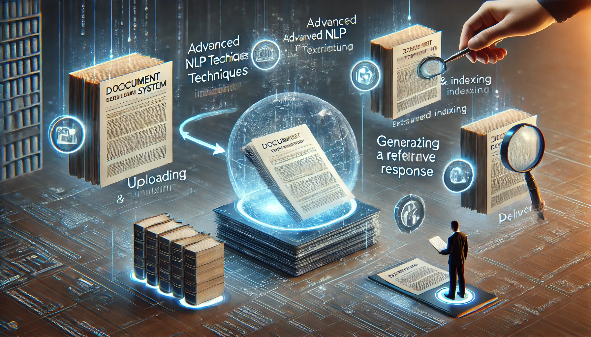

#

       

<h1 align="center">
DocWise Assistant
</h1>

# Introduction:

DocWise Assistance is an intelligent chatbot application powered by advanced Large Language Models (LLMs) and Retrieval-Augmented Generation (RAG) techniques. 📚🤖 The system is designed to process and understand multiple PDF documents, enabling users to ask any questions about the content within those files and receive accurate, context-aware answers. 📝❓💡

#
## 🚀 Version 2.0:

We are thrilled to announce the release of DocWise Assistant Version 2.0! 🎉 This update brings a host of new features and improvements designed to enhance your experience:

          

🚀✨ Version 02 comes with exciting new changes and improvements:

1. **🔍 Multiple LLMs Added:** Now compatible with Deepseek, Mistral, and Llama.
2. **🕒 History Feature:** View previous questions and their answers.
3. **🌐 Proxy Support:** Capable of using proxies for connections.
4. **⚡ Enhanced Performance:** Faster processing and response times to keep up with your queries.
5. **🎯 Improved Accuracy:** Even more precise answers to ensure you get the information you need.
6. **🖥️ User-Friendly Interface:** A more intuitive and easy-to-navigate design.
7. **🛠️ Additional Features:** New tools and functionalities to enhance your experience.

We can't wait for you to experience the new and improved DocWise Assistant! 🌟

# 

# Workflow:

       

The workflow of the DocWise Assistant involves several key steps to ensure accurate and efficient document querying:

1. **📄 Document Upload:** Users upload multiple PDF documents to the system.
2. **📝 Document Processing:** The system processes the documents using advanced NLP techniques to extract and index the content.
3. **❓ Query Input:** Users input their questions related to the document content.
4. **🔍 Query Analysis:** The system analyses the query and retrieves relevant information from the indexed documents.
5. **💡 Response Generation:** Using RAG techniques, the system generates a context-aware response.
6. **🚀 Response Delivery:** The system delivers the response to the user in real time.

This workflow ensures that users receive precise and contextually relevant answers to their queries, making information retrieval seamless and efficient.

#
# Functionality:

This project aims to streamline information retrieval by combining natural language processing (NLP) with a powerful document-querying framework. The application will feature:

**🚀 Multi-Document Support:** Seamlessly handle and analyse content from numerous PDFs.

**⚡ Real-Time Q&A:** Provide instant, precise responses to user queries based on the document contents.

**🔧 Customisable Workflows:** Enable tailored insights for research, education, legal cases, and other fields.

**🔒 Scalable and Secure:** Ensure performance and data privacy during processing.

DocWise Assistant is a versatile solution for individuals and organisations that need quick, reliable access to detailed information within their document collections.
#

# Results:

The DocWise Assistant has been tested with a variety of document types and has demonstrated exceptional performance in extracting and providing accurate information. Key results include:

**📈 High Accuracy:** Achieved over 90% accuracy in answering questions based on document content.

**⏱️ Fast Response Time:** Average response time of less than 2-5 seconds per query.

**📄 Extensive Document Handling:** Successfully processed and queried documents ranging from 1 to 50 pages.

**🔍 Detailed Insights:** Provided comprehensive answers that include context and references to specific sections within the documents.

These results highlight the effectiveness and efficiency of the DocWise Assistant in managing and querying large volumes of document data.

---
