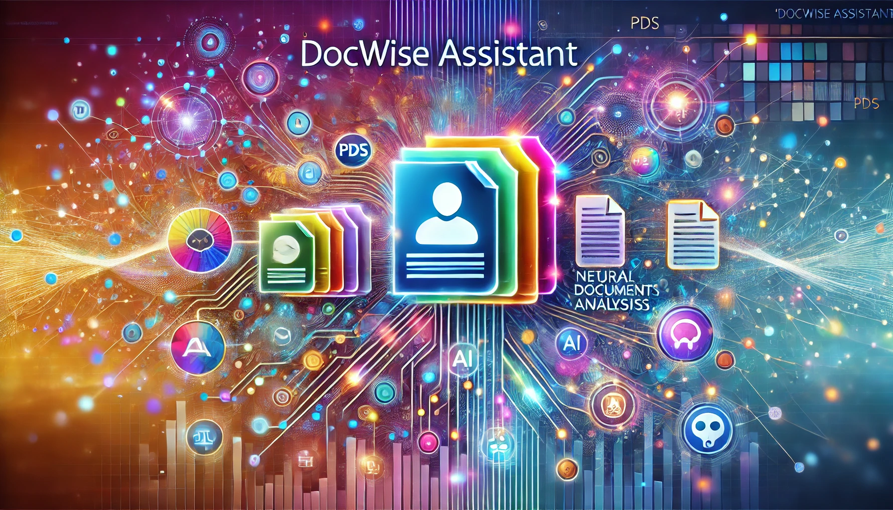

#

       

<h1 align="center">
DocWise Assistant
</h1>

DocWise Assistance is an intelligent chatbot application powered by advanced Large Language Models (LLMs) and Retrieval-Augmented Generation (RAG) techniques. The system is designed to process and understand multiple PDF documents, enabling users to ask any questions about the content within those files and receive accurate, context-aware answers.

#

This project aims to streamline information retrieval by combining natural language processing (NLP) with a powerful document-querying framework. The application will feature:

**1. Multi-Document Support:** Seamlessly handle and analyse content from numerous PDFs.

**2. Real-Time Q&A:** Provide instant, precise responses to user queries based on the document contents.

**3. Customisable Workflows:** Enable tailored insights for research, education, legal cases, and other fields.

**4. Scalable and Secure:** Ensure performance and data privacy during processing.

DocWise Assistant is a versatile solution for individuals and organisations that need quick, reliable access to detailed information within their document collections.
